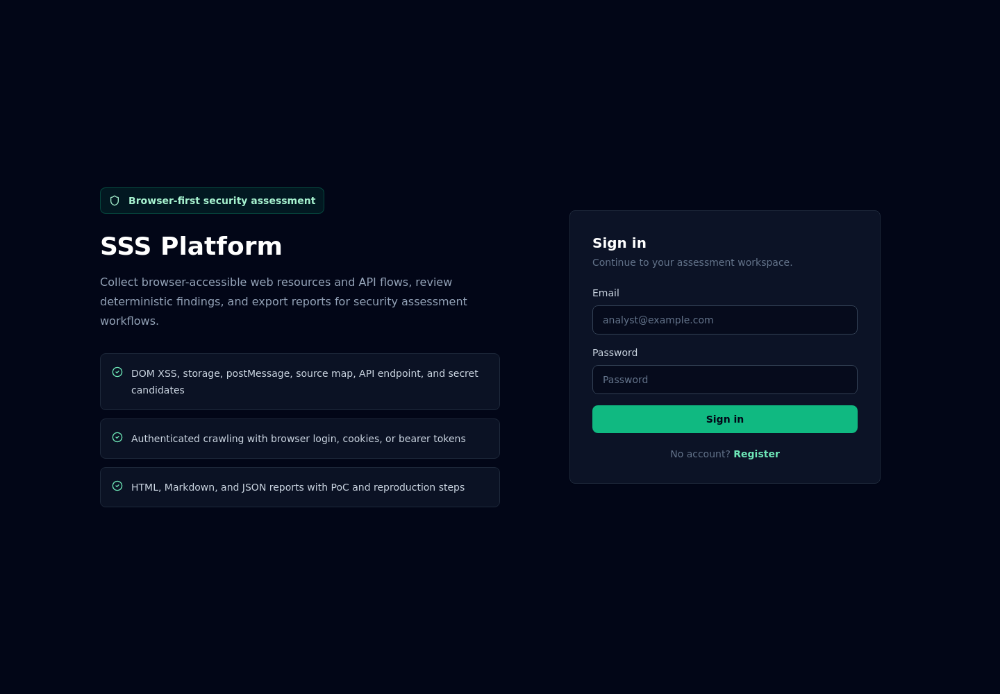
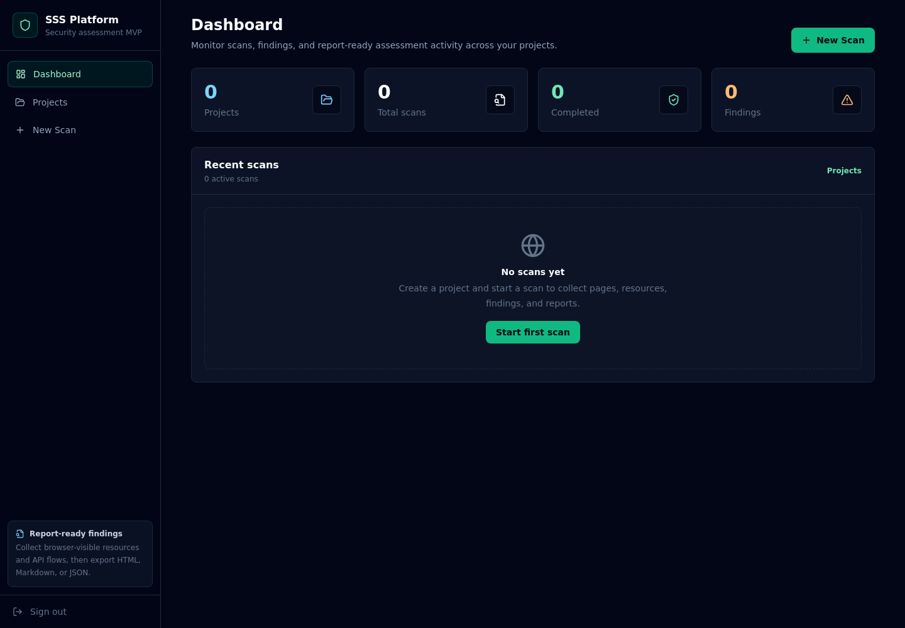
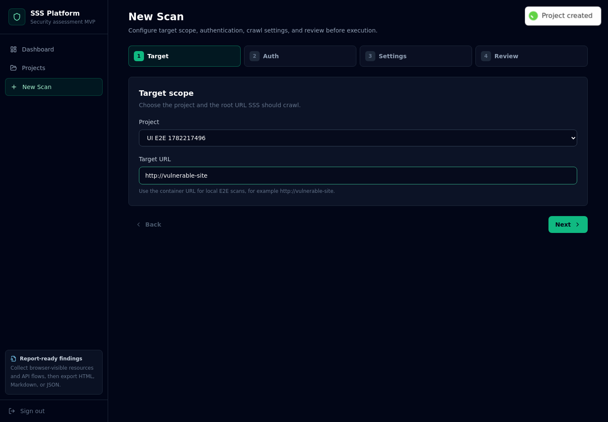
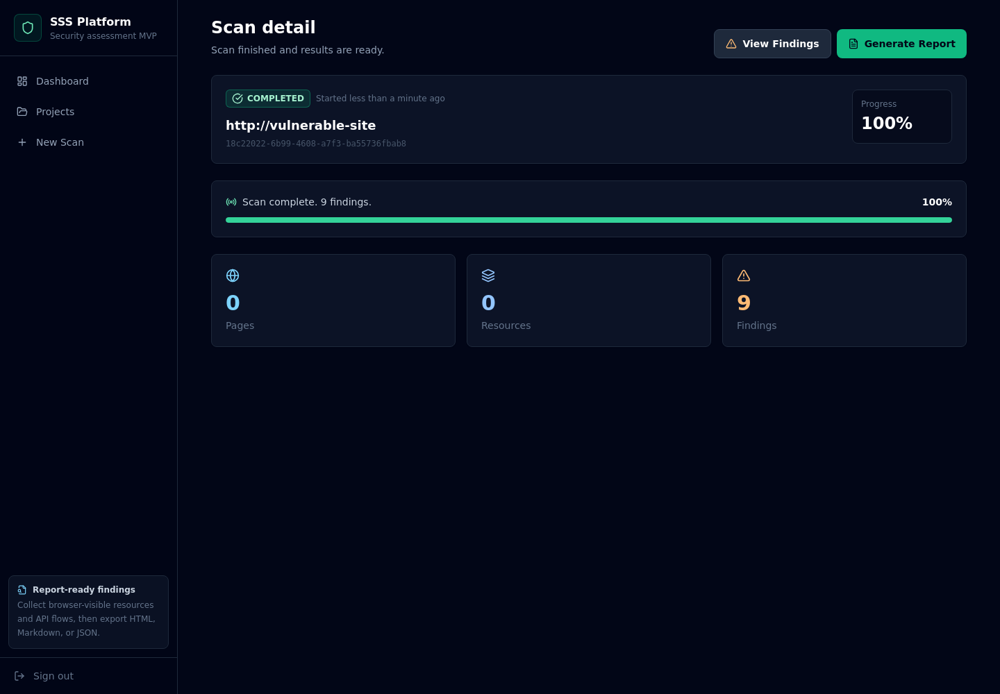
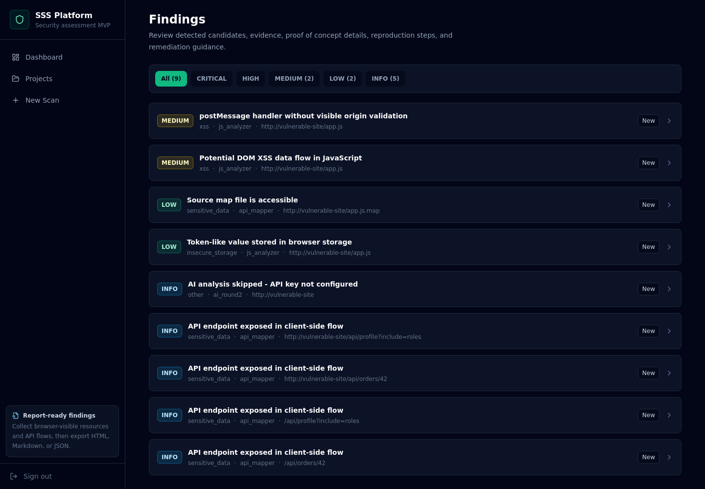
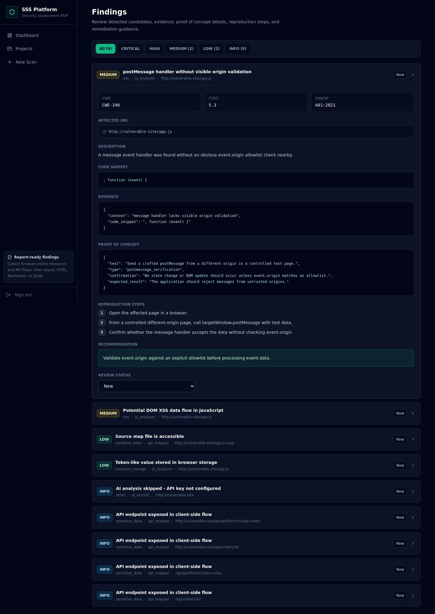
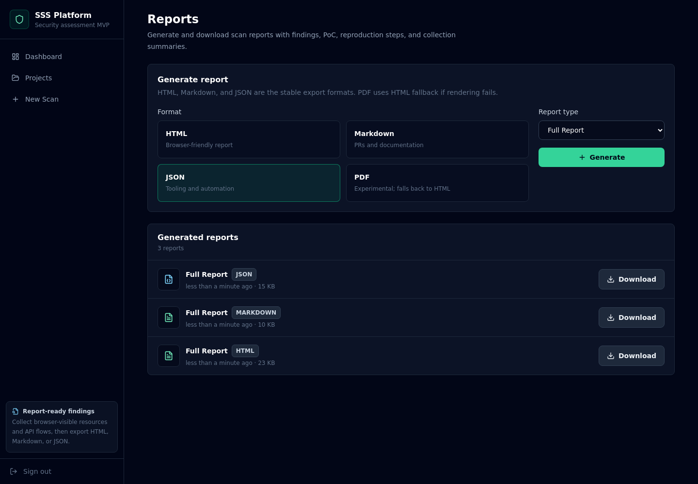
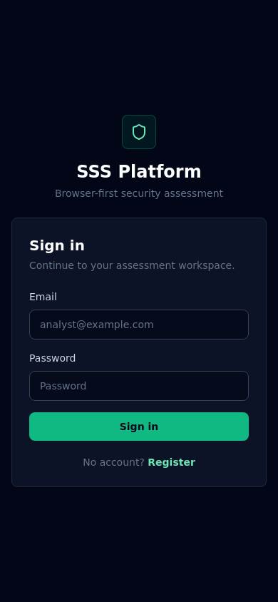

# SSS Platform - Smart Security Scanner

SSS Platform은 브라우저에서 접근 가능한 웹 리소스와 API 흐름을 수집·분석해 보안 점검 결과와 보고서를 생성하는 웹 애플리케이션 보안 분석 MVP입니다.

대상 URL을 입력하면 Playwright 기반 크롤러가 페이지, JavaScript, source map, XHR/fetch 후보 등을 수집하고, 정적 분석 에이전트가 DOM XSS 후보, postMessage 처리, 브라우저 저장소 토큰 사용, API endpoint 노출, source map 노출, secret/token 후보를 finding으로 정리합니다. 결과는 웹 UI에서 확인하고 HTML, Markdown, JSON 보고서로 다운로드할 수 있습니다.

> 이 프로젝트는 허가받은 보안 테스트와 포트폴리오 데모 목적의 MVP입니다. 허가받지 않은 시스템을 대상으로 스캔하지 마세요.

## 현재 상태

검증된 MVP 범위:

- Docker Compose 기반 실행
- 회원가입 / 로그인
- 프로젝트 생성
- No Auth 스캔 생성
- Playwright 기반 크롤링
- WebSocket 기반 스캔 진행 상태 표시
- Finding 목록 및 상세 확인
- `code_snippet`, `poc`, `reproduction_steps` 표시
- HTML / Markdown / JSON 보고서 생성 및 다운로드
- E2E 검증용 vulnerable-site profile 제공

최근 검증 결과:

- `docker compose config` 통과
- `docker compose build` 통과
- `docker compose --profile e2e up -d` 통과
- `backend`: `36 passed`
- `frontend`: `npm run build` 통과
- 실제 브라우저 E2E 통과

## Architecture

```text
Browser UI
  |
  v
Nginx reverse proxy
  |
  +-- FastAPI backend
  |     +-- PostgreSQL
  |     +-- Redis
  |
  +-- Celery worker
  |     +-- analysis / reports
  |
  +-- Celery worker-browser
        +-- Playwright crawler
```

주요 구성:

- `backend`: FastAPI, SQLAlchemy, Alembic, Celery
- `frontend`: React, Vite, React Query, Axios
- `worker-browser`: Playwright 크롤링 및 브라우저 기반 수집
- `worker`: 분석 및 보고서 생성
- `postgres`: 스캔, finding, report 메타데이터 저장
- `redis`: Celery broker/result backend 및 progress pub/sub
- `nginx`: 프론트엔드 / API / WebSocket reverse proxy

## Requirements

- Docker 24+
- Docker Compose v2+
- Node.js 20+ and Python 3.12+ only for local development

AI API key는 선택 사항입니다. 현재 MVP의 핵심 E2E finding은 deterministic analyzer로 생성됩니다. `ANTHROPIC_API_KEY`가 비어 있거나 placeholder 값이면 AI round2 분석은 실패가 아니라 `AI analysis skipped - API key not configured` 상태로 건너뛰며, deterministic round1 finding과 보고서 생성은 계속 동작합니다. AI round2 분석을 사용하려면 별도 API key 설정이 필요합니다.

## Quick Start

```bash
docker compose build
docker compose up -d
```

기본 개발값은 `docker-compose.yml`에 포함되어 있어 로컬 데모는 `.env` 없이도 실행할 수 있습니다. 값을 명시적으로 관리하려면 다음처럼 예시 파일을 복사해 사용하세요.

```bash
cp .env.example .env
```

접속:

- Web UI: `http://localhost`
- Swagger UI: `http://localhost/api/docs`
- ReDoc: `http://localhost/api/redoc`

서비스 상태와 로그:

```bash
docker compose ps
docker compose logs --tail=100 backend
docker compose logs --tail=100 worker
docker compose logs --tail=100 worker-browser
```

중지:

```bash
docker compose down
```

데이터까지 초기화:

```bash
docker compose down -v
```

## Environment

주요 환경변수:

| 변수 | 기본값 / 예시 | 설명 |
|---|---|---|
| `POSTGRES_USER` | `sss` | PostgreSQL 사용자 |
| `POSTGRES_PASSWORD` | `change_me_strong_password` | PostgreSQL 비밀번호 |
| `POSTGRES_DB` | `sss_platform` | 기본 DB |
| `SECRET_KEY` | dev 기본값 제공 | JWT 서명 키 |
| `FERNET_KEY` | dev 기본값 제공 | 세션 데이터 암호화 키 |
| `ENVIRONMENT` | `development` | 실행 환경 |
| `SCAN_DATA_PATH` | `/data/scans` | 수집 리소스와 보고서 저장 경로 |
| `SSRF_ALLOWED_HOSTS` | Compose 기본값: `vulnerable-site,host.docker.internal` | development/e2e/test에서만 허용되는 테스트 host |
| `ALLOW_PRIVATE_TARGETS` | `false` | 기본값은 private target 차단 |
| `ANTHROPIC_API_KEY` | empty | AI round2 분석용 선택 값 |

SSRF 정책:

- 기본적으로 `localhost`, loopback, private IP, link-local, reserved IP는 차단합니다.
- 운영 기본값은 private target 차단입니다.
- E2E/dev 편의를 위해 `SSRF_ALLOWED_HOSTS`에 명시된 host만 `development`, `e2e`, `test` 환경에서 허용합니다.
- `ALLOW_PRIVATE_TARGETS=false`가 기본값입니다.

## Demo Flow

브라우저에서 다음 흐름으로 MVP를 확인할 수 있습니다.

1. `http://localhost` 접속
2. 회원가입
3. 로그인
4. `Projects`에서 새 프로젝트 생성
5. `New Scan` 생성
6. Target URL 입력
7. Authentication에서 `No Auth` 선택
8. Crawl settings 확인
9. `Start Scan`
10. 스캔 완료 후 `View Findings`
11. Finding 상세에서 evidence, code snippet, PoC, reproduction steps 확인
12. `Generate Report`
13. HTML / Markdown / JSON 보고서 생성
14. 각 보고서 다운로드

## Screenshots

| Login | Dashboard |
|---|---|
|  |  |

| Scan wizard | Scan detail |
|---|---|
|  |  |

| Findings | Finding detail |
|---|---|
|  |  |

| Reports | Mobile login |
|---|---|
|  |  |

## E2E Vulnerable Site

로컬 데모와 회귀 검증을 위해 의도적으로 취약한 테스트 타겟을 제공합니다. 이 타겟은 SSS 탐지 기능 검증용이며 외부 공격 목적이 아닙니다.

기동:

```bash
docker compose --profile e2e up -d vulnerable-site
```

전체 스택과 함께 실행:

```bash
docker compose --profile e2e up -d
```

테스트 타겟:

- 컨테이너 내부 target URL: `http://vulnerable-site`
- 호스트 브라우저 확인 URL: `http://localhost:8081`

E2E 스캔 권장 설정:

- Project: 임의 프로젝트
- Target URL: `http://vulnerable-site`
- Auth: `No Auth`
- Max Depth: `2`
- Max Pages: `10`
- Analyze Source Maps: enabled

테스트 페이지에는 다음 신호가 포함되어 있습니다.

- DOM XSS 후보
- `postMessage` handler
- `localStorage` / `sessionStorage` token-like value
- `//# sourceMappingURL=/app.js.map`
- `/api/profile?include=roles`
- `/api/orders/42`
- bearer token 형태의 client-side header

## Detectable Finding Types

현재 MVP에서 검증된 finding 유형:

| 유형 | 설명 | 대표 finding |
|---|---|---|
| DOM XSS candidate | URL hash/query 또는 message data가 위험한 DOM sink로 흐르는 패턴 | `Potential DOM XSS data flow in JavaScript` |
| postMessage origin validation candidate | `message` event handler 주변에 명시적 `event.origin` 검증이 보이지 않는 패턴 | `postMessage handler without visible origin validation` |
| Insecure storage | token/JWT/access token 후보가 `localStorage` 또는 `sessionStorage`에서 사용되는 패턴 | `Token-like value stored in browser storage` |
| Source map exposure | production-like asset에서 source map이 접근 가능한 상태 | `Source map file is accessible` |
| API endpoint exposure | browser traffic 또는 JS bundle에서 API endpoint 후보가 발견되는 상태 | `API endpoint exposed in client-side flow` |
| Secret/token candidate | JS/HTML/JSON/source map 내 key, token, JWT, secret-like string 후보 | `API key`, `JWT Token`, `Generic Secret` 등 |

Finding 상세에는 가능한 경우 다음 필드가 포함됩니다.

- `code_snippet`
- `poc`
- `reproduction_steps`
- `affected_url`
- `evidence`
- `recommendation`
- CWE / CVSS / OWASP mapping

## Reports

보고서는 scan이 `completed` 상태일 때 생성할 수 있습니다.

지원 형식:

- `HTML`: 브라우저로 열어보기 좋은 전체 보고서
- `Markdown`: 이슈, PR, 문서 저장소에 첨부하기 좋은 형식
- `JSON`: 다른 도구와 연동하기 위한 구조화 데이터
- `PDF`: 실험적 지원. PDF 렌더링이 실패하면 같은 내용의 HTML report path로 fallback하며, HTML/Markdown/JSON 보고서 기능은 막지 않습니다.

검증된 다운로드 형식:

- HTML
- Markdown
- JSON

보고서에는 finding별로 다음 정보가 포함됩니다.

- 심각도
- 취약점 유형
- 설명
- evidence / code snippet
- PoC
- reproduction steps
- recommendation
- collection summary

## Local Development

백엔드 테스트:

```bash
cd backend
.venv/bin/python -m pytest tests/ -v
```

프론트엔드 빌드:

```bash
cd frontend
npm install
npm run build
```

Python import smoke:

```bash
cd backend
.venv/bin/python -m compileall app tests
```

Docker 검증:

```bash
docker compose config
docker compose build
docker compose --profile e2e up -d
```

`make test`도 제공되지만, 로컬 환경에 따라 `python` 명령이 없을 수 있습니다. 그 경우 위의 `.venv/bin/python -m pytest tests/ -v` 명령을 사용하세요.

## API Overview

주요 API:

```text
POST   /api/v1/auth/register
POST   /api/v1/auth/login
POST   /api/v1/auth/refresh

GET    /api/v1/projects
POST   /api/v1/projects

GET    /api/v1/scans
POST   /api/v1/scans
GET    /api/v1/scans/{scan_id}
POST   /api/v1/scans/{scan_id}/cancel
POST   /api/v1/scans/{scan_id}/browser-auth/start

GET    /api/v1/findings
PATCH  /api/v1/findings/{finding_id}

GET    /api/v1/reports/scans/{scan_id}
POST   /api/v1/reports/scans/{scan_id}/generate
GET    /api/v1/reports/{report_id}/download

WS     /ws/scans/{scan_id}?token=<jwt>
```

## Project Structure

```text
.
├── backend/
│   ├── alembic/
│   ├── app/
│   │   ├── api/
│   │   ├── core/
│   │   ├── models/
│   │   ├── schemas/
│   │   ├── services/
│   │   │   ├── analysis/
│   │   │   ├── auth/
│   │   │   ├── collector/
│   │   │   ├── crawler/
│   │   │   └── report/
│   │   └── workers/
│   └── tests/
├── e2e/
│   └── vulnerable-site/
├── frontend/
│   └── src/
├── infra/
│   └── nginx/
├── docker-compose.yml
└── README.md
```

## Troubleshooting

### Backend migration

backend entrypoint runs:

```bash
alembic upgrade head
```

If migration fails, backend logs include an explicit entrypoint message:

```bash
docker compose logs --tail=100 backend
```

### Existing Docker volume password mismatch

If a previous Postgres volume was created with a different password, reset volumes:

```bash
docker compose down -v
docker compose up -d
```

### Nginx upstream after container recreation

Nginx uses Docker DNS resolver (`127.0.0.11`) so recreated backend/frontend containers are resolved dynamically. If a stale connection appears during local development:

```bash
docker compose restart nginx
```

### Host browser cannot reach localhost in WSL

The application may be reachable inside the Docker network even if the shell cannot `curl localhost`. Check from a container:

```bash
docker exec source_platform_reading-nginx-1 wget -qO- http://backend:8000/health
```

## TODO

MVP 이후 남은 작업:

- Verify Celery non-root worker behavior across more deployment targets
- Frontend design and UX polish
- Improve native PDF rendering stability beyond the current HTML fallback
- Broader browser-auth E2E coverage
- More precise false-positive reduction for static findings

## License and Responsible Use

Use this project only on systems you own or have explicit permission to test. The scanner collects and analyzes browser-accessible resources and API flows; it is not intended for unauthorized scanning.
